##

<div align = "center">  
⭐스타를 눌러주세요 개발에 큰 도움이 됩니다!⭐️<br>
<i><h4><a href="https://github.com/devxb/gitanimals/stargazers">Press star</a></h4></i>
</div>

<div align="center">
<h3>깃허브 활동으로 펫을 키우세요!</h3> 
<h4> 깃허브 활동으로 펫을 성장시킬 수 있습니다.
<br> 커밋을 30번 하면 1개의 펫을 추가로 입양할 수 있어요.
<br> 1개의 contribution은 랜덤한 펫의 level을 1 증가시켜요.
<br>
<br>
40 종류가 넘는 펫을 뽑고 기르세요.
</h4>
<br>
<a href="https://github.com/devxb/gitanimals">
    
</a>
</div>

## 빠르게 사용하기

아래의 MARKDOWN 혹은 HTML 방식중 하나를 붙여넣기 하는것으로 쉽게 적용할 수 있어요.

```markdown
[](https://github.com/devxb/gitanimals)
```

```html
<a href="https://github.com/devxb/gitanimals">
    
</a>
```
   
> [!IMPORTANT]   
> {username} 은 자신의 깃허브 닉네임 (ex. devxb) 으로 변경해주세요.    
> 이때, {username} 은 반드시 자신의 깃허브 이름이 들어가야 합니다.   


## TIPS

### 펫을 획득하는 방법

펫은 다음 두가지 방법으로 획득할 수 있습니다.

1. **커밋 30번하기**    
    커밋이 30번 누적되면 새로운 펫이 등장해요. 이때, 모든 펫들은 등장하는 확률이 다릅니다.   
    이때, 최대로 얻을 수 있는 펫은 30개 입니다. 30개가 넘는 펫은 인벤토리로 들어가며, 언제든지 보여지는 펫과 교체할 수 있어요. **_<- 개발중_** 
2. **펫 구매하기** **_<- 개발중_**   
    다른 유저가 판매하는 펫을 커밋포인트로 구매할 수 있어요.    
    커밋 1회당 일정량의 포인트가 지급됩니다. 혹은 자신의 펫을 판매해서 커밋포인트를 얻을수도 있어요.     

### 등장 가능한 펫들


---

<div align="center">
<p> 아이디어나 발견 한 버그가 있다면 제보 해주세요.
<i>Contact : develxb@gmail.com</i></p>
</div>
