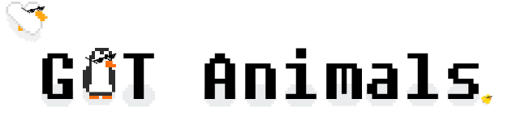

##

<a href="https://github.com/devxb/gitanimals">
  
</a>

<div align="center">

[English](README-en.md) | **한국어** | [简体中文](README-zhcn.md) | [日本語](README-ja.md)

<a href="https://hits.sh/github.com/git-goods/gitanmals/"></a>
<a href="https://www.instagram.com/gitanimals"></a>
</div>

<div align = "center">  
<a href="https://github.com/devxb/gitanimals">
    
</a>

⭐스타를 눌러주세요 개발에 큰 도움이 됩니다!⭐️<br>
<i><h4><a href="https://github.com/devxb/gitanimals/stargazers">Press star</a></h4></i>
</div>

<div align="center">
<h3>깃허브 활동으로 펫을 키우세요!</h3> 
<h4> 깃허브 활동으로 펫을 획득하고 성장시킬 수 있어요.
<br> 커밋을 30번 하면 1개의 펫을 추가로 입양할 수 있어요.
<br> 1개의 contribution은 랜덤한 펫의 level을 1 증가시켜요.
<br> 키운 펫은 다른사람과 거래할 수 있어요.     
<br> 배경을 구매하고 변경할 수 있어요.
<br> 길드를 만들고 친구와 함께 펫을 키울 수 있어요.
<br>
<br>
50 종류가 넘는 펫을 뽑고 기르세요.
<br>

[홈페이지](https://gitanimals.org) 에서 펫을 거래하고, 배경을 구매하고 길드를 만들 수 있어요.

</h4>
<br>
<a href="https://www.gitanimals.org/">
      
</a>
</div>

## 빠르게 사용하기

아래의 링크를 깃허브 Readme 에 붙여넣기 하는것으로 쉽게 적용할 수 있어요.

> [!IMPORTANT]   
> {username} 은 자신의 깃허브 닉네임 (ex. devxb) 으로 변경해주세요.    
> 이때, {username} 은 반드시 자신의 깃허브 이름이 들어가야 합니다.

### line mode

line mode는 자신이 가지고 있는 펫중 하나를 지정해서, 지정한 width, height범위에서 움직이게 해요.   
line mode를 사용할때, markdown 방식으로 이미지를 요청하면, width, height를 설정할 수 없어서 펫이 보이지 않을 수 있으니, HTML방식을
사용해 주세요.

> [!TIP]   
> **Img의 width와 height를 조절해서 펫의 이동영역을 조절할 수 있어요.**   
> width를 길게 height를 작게하면 (width = 1000, height = 60) 가로로 길게 움직이게 할 수 있어요.   
> 반대로, width를 작게 height를 길게하면 (width = 60, height = 1000) 세로로 길게 움직이게 할 수 있어요.   
> 만약, 펫이 보이지 않는다면, img의 height를 펫의 세로 길이보다 충분히 크게 적용해주세요.


<a href="https://github.com/devxb/gitanimals">
    
</a>

```html
<a href="https://github.com/devxb/gitanimals">
  
</a>
```   

_pet-id에 아무값도 입력하지 않으면, 첫번째 펫이 가져와져요._

변경 가능한 pet-id는 `https://render.gitanimals.org/users/{username}` 의 {username}을 자신의 깃허브 아이디로 변경 후 API를
요청하면 확인할 수 있어요.   
API 응답의 `$.personas.[].id` 에 해당하는 값을 pet-id에 입력하면 돼요.

lines모드에서는 펫 레벨 위에 총 contributions수를 보여줘요. 원하지 않을 경우, 쿼리 파라미터로 `contribution-view=false`를 담아 요청하세요.

### farm mode

farm mode는 가지고 있는 모든 동물과 추가적인 정보를 보여줘요.

<a href="https://github.com/devxb/gitanimals">
    
</a>

**html**

```html
<a href="https://github.com/devxb/gitanimals">
  
</a>
```

### guild mode

길드를 만들고 친구와 함께 펫을 키울 수 있어요.   
[길드 만들러 가기](https://gitanimals.org/guild)

<a href="https://www.gitanimals.org/">
      
</a>

**html**

```html
<a href="https://github.com/devxb/gitanimals">
  
</a>
```

## TIPS

### 펫을 획득하는 방법

펫은 다음 두가지 방법으로 획득할 수 있어요.

1. **커밋 30번하기**    
   커밋이 30번 누적되면 새로운 펫이 등장해요. 이때, 모든 펫들은 등장하는 확률이 달라요.   
   이때, 최대로 얻을 수 있는 펫은 30개 입니다. 30개가 넘는 펫은 인벤토리로 들어가며, 홈페이지에서 언제든지 보여지는 펫과 교체할 수 있어요.
2. **펫 구매하기**    
   다른 유저가 판매하는 펫을 커밋포인트로 구매할 수 있어요.    
   커밋 1회당 일정량의 포인트가 지급됩니다. 혹은 자신의 펫을 판매해서 커밋포인트를 얻을수도 있어요.

### Total contributions

Total contribtuions는 깃허브에 가입 후 집계된 Contribtuions의 총합이에요.    
_새로운 contribution 반영은 최대 1시간이 소요될 수 있어요._

### 등장 가능한 펫들

| name                                                                                                        | ratio     | Description                                                                                                                                                                  |
|-------------------------------------------------------------------------------------------------------------|-----------|------------------------------------------------------------------------------------------------------------------------------------------------------------------------------|
| RUDOLPH <br>                                      | 0.001     | 2025 Christmas pet Designed by [@sumi-0011](https://github.com/sumi-0011)                                                                                                    |
| HAMSTER_SNOW_SWEET_POTATO <br>  | 0.009     | ❄️2025 Winter pet ❄️                                                                                                                                                         |
| HAMSTER_SNOW <br>                            | 0.01      | ❄️2025 Winter pet ❄️                                                                                                                                                         |
| PIG_ROBOT <br>                                | Evolution | Only for evolution                                                                                                                                                           |
| GOOSE_ROBOT <br>                             | Evolution | Only for evolution                                                                                                                                                           |
| FLAMINGO_WHITE <br>                       | Evolution | Only for evolution                                                                                                                                                           |
| SLIME_ANGEL <br>                              | Evolution | Only for evolution                                                                                                                                                           |
| CAT_WINDOW <br>                               | Evolution | Only for evolution                                                                                                                                                           |
| LITTLE_CHICK_ANGEL <br>                | Evolution | Only for evolution                                                                                                                                                           |
| LITTLE_CHICK_EGG_ON_HAT <br>      | Evolution | Only for evolution                                                                                                                                                           |
| CAPYBARA_SWIM <br>                         | 0.4       | Designed by [@Choi_sunwoo](https://www.behance.net/6a39a177)                                                                                                                 |
| CAPYBARA_CARROT <br>                      | 0.6       | Designed by [@Choi_sunwoo](https://www.behance.net/6a39a177)                                                                                                                 |
| CAPYBARA <br>                                    | 0.8       | Designed by [@Choi_sunwoo](https://www.behance.net/6a39a177)                                                                                                                 |
| LITTLE_CHICK_TUBE <br>                  | 0.01      | 🏖️2025 Summer pet 🏖                                                                                                                                                        |
| RABBIT_TUBE <br>                              | 0.01      | 🏖️2025 Summer pet 🏖                                                                                                                                                        |
| HAMSTER_TUBE <br>                           | 0.01      | 🏖️2025 Summer pet 🏖                                                                                                                                                        |
| SHIBA <br>                                          | 0.3       |                                                                                                                                                                              |
| SHIBA_KING <br>                                | 0.01      |                                                                                                                                                                              |
| UNICORN <br>                                      | 0.001     | Designed by [@Choi_sunwoo](https://www.behance.net/6a39a177)                                                                                                                 |
| MALTESE_KING <br>                            | 0.01      |                                                                                                                                                                              |
| MALTESE <br>                                      | 0.02      |                                                                                                                                                                              |
| SNOWMAN_MELT <br>                           | 0.001     | 🎄2024 Christmas pet🎄                                                                                                                                                       |
| SNOWMAN <br>                                     | 0.005     | 🎄2024 Christmas pet🎄                                                                                                                                                       |
| DESSERT_FOX_RUDOLPH <br>                | 0.005     | 🎄2024 Christmas pet🎄                                                                                                                                                       |
| RABBIT_BROWN_RUDOLPH <br>              | 0.007     | 🎄2024 Christmas pet🎄                                                                                                                                                       |
| LITTLE_CHICK_SANTA <br>                  | 0.01      | 🎄2024 Christmas pet🎄                                                                                                                                                       |
| HAMSTER_SANTA <br>                         | 0.01      | 🎄2024 Christmas pet🎄                                                                                                                                                       |
| HAMSTER_JS <br>                               | 0.01      |                                                                                                                                                                              |
| HAMSTER_KOTLIN <br>                       | 0.01      |                                                                                                                                                                              |
| HAMSTER_JAVA <br>                           | 0.01      |                                                                                                                                                                              |
| HAMSTER_SPRING <br>                       | 0.01      |                                                                                                                                                                              |
| HAMSTER <br>                                     | 0.8       |                                                                                                                                                                              |
| SCREAM_GHOST <br>                           | 0.001     | 😱2024 Halloween pet😱                                                                                                                                                       |
| SCREAM <br>                                       | 0.005     | 😱2024 Halloween pet😱                                                                                                                                                       |
| GHOST_KING <br>                               | 0.01      | 👻2024 Halloween pet👻                                                                                                                                                       |
| GHOST <br>                                         | 0.05      | 👻2024 Halloween pet👻                                                                                                                                                       |
| SLIME_PUMPKIN_1 <br>                        | 0.08      | 🎃2024 Halloween pet🎃                                                                                                                                                       |
| SLIME_PUMPKIN_2 <br>                        | 0.08      | 🎃2024 Halloween pet🎃                                                                                                                                                       |
| TURTLE <br>                                       | 0.03      | Designed by [@JIWOO CHOI](https://www.behance.net/sopungcjw42af)                                                                                                             |
| SLOTH_SUNGLASSES <br>                    | 0.06      |                                                                                                                                                                              |
| SLOTH_KING <br>                                | 0.05      |                                                                                                                                                                              | 
| SLOTH <br>                                          | 0.7       |                                                                                                                                                                              |
| DESSERT_FOX <br>                              | 0.05      |                                                                                                                                                                              |
| RABBIT <br>                                        | 0.9       |                                                                                                                                                                              |
| MOLE <br>                                           | 0.3       |                                                                                                                                                                              |
| MOLE_GRASS <br>                               | 0.1       |                                                                                                                                                                              |
| QUOKKA <br>                                       | 0.3       |                                                                                                                                                                              |
| QUOKKA_LEAF <br>                             | 0.1       |                                                                                                                                                                              |
| QUOKKA_SUNGLASSES <br>                 | 0.05      |                                                                                                                                                                              |
| FISH_MAN <br>                                       | 0.001     |                                                                                                                                                                              |
| FISH_MAN_GLASSES <br>                      | 0.001     |                                                                                                                                                                              |
| flamingo <br>                                       | 0.08      |                                                                                                                                                                              |
| TEN_MM <br>                                           | 0.00      | Character created by `10MM` donations <br> Only buy in shop <br> <a href="https://github.com/depromeet/10mm-client-web"> 10MM </a>                                           |
| goblin <br>                                          | 0.06      |                                                                                                                                                                              |
| goblin-bag <br>                                 | 0.03      |                                                                                                                                                                              |
| bibbi <br>                                          | 0.00      | Character created by `BIBBI` donations <br> Only buy in shop <br> <a href="https://play.google.com/store/apps/details?id=com.no5ing.bbibbi&hl=es_PY&gl=US&pli=1"> BIBBI </a> |
| cat <br>                                                | 0.1       |                                                                                                                                                                              |
| cheese-cat <br>                                  | 0.04      |                                                                                                                                                                              |
| galchi-cat <br>                                  | 0.06      |                                                                                                                                                                              |
| white-cat <br>                                    | 0.04      |                                                                                                                                                                              |
| goose <br>                                           | 1.0       |                                                                                                                                                                              |
| goose_sunglasses <br>                     | 0.05      |                                                                                                                                                                              |
| goose_kotlin <br>                             | 0.01      |                                                                                                                                                                              |
| goose_java <br>                                 | 0.01      |                                                                                                                                                                              |
| goose_js <br>                                     | 0.01      |                                                                                                                                                                              |
| goose_node <br>                                 | 0.01      |                                                                                                                                                                              |
| goose_swift <br>                               | 0.01      |                                                                                                                                                                              |
| goose_linux <br>                               | 0.01      |                                                                                                                                                                              |
| goose_spring <br>                             | 0.01      |                                                                                                                                                                              |
| little_chick <br>                              | 0.9       |                                                                                                                                                                              |
| little_chick_sunfsuglasses <br>     | 0.4       |                                                                                                                                                                              |
| little_chick_kotlin <br>                | 0.01      |                                                                                                                                                                              |
| little_chick_java <br>                    | 0.01      |                                                                                                                                                                              |
| little_chick_js <br>                        | 0.01      |                                                                                                                                                                              |
| little_chick_node <br>                    | 0.01      |                                                                                                                                                                              |
| little_chick_swift <br>                  | 0.01      |                                                                                                                                                                              |
| little_chick_linux <br>                  | 0.01      |                                                                                                                                                                              |
| little_chick_spring <br>                | 0.01      |                                                                                                                                                                              |
| penguin <br>                                       | 0.5       |                                                                                                                                                                              |
| penguin_sunglasses <br>                 | 0.2       |                                                                                                                                                                              |
| penguin_kotlin <br>                         | 0.01      |                                                                                                                                                                              |
| penguin_java <br>                             | 0.01      |                                                                                                                                                                              |
| penguin_js <br>                                 | 0.01      |                                                                                                                                                                              |
| penguin_node <br>                             | 0.01      |                                                                                                                                                                              |
| penguin_swift <br>                           | 0.01      |                                                                                                                                                                              |
| penguin_linux <br>                           | 0.01      |                                                                                                                                                                              |
| penguin_spring <br>                         | 0.01      |                                                                                                                                                                              |
| pig <br>                                               | 0.2       |                                                                                                                                                                              |
| pig_sunglasses <br>                         | 0.08      |                                                                                                                                                                              |
| pig_kotlin <br>                                 | 0.01      |                                                                                                                                                                              |
| pig_java <br>                                     | 0.01      |                                                                                                                                                                              |
| pig_js <br>                                         | 0.01      |                                                                                                                                                                              |
| pig_node <br>                                     | 0.01      |                                                                                                                                                                              |
| pig_swift <br>                                   | 0.01      |                                                                                                                                                                              |
| pig_linux <br>                                   | 0.01      |                                                                                                                                                                              |
| pig_spring <br>                                 | 0.01      |                                                                                                                                                                              |
| slime_red <br>                                    | 0.1       |                                                                                                                                                                              |
| slime_red_kotlin <br>                      | 0.001     |                                                                                                                                                                              |
| slime_red_java <br>                          | 0.001     |                                                                                                                                                                              |
| slime_red_js <br>                              | 0.001     |                                                                                                                                                                              |
| slime_red_node <br>                          | 0.001     |                                                                                                                                                                              |
| slime_red_swift <br>                        | 0.001     |                                                                                                                                                                              |
| slime_red_linux <br>                        | 0.001     |                                                                                                                                                                              |
| slime_green <br>                                | 0.1       |                                                                                                                                                                              |
| slime_blue <br>                                  | 0.1       |                                                                                                                                                                              |
| cheese_cat_collaborator <br>       | 0.0       | Pet made for collaborator [devxb](https://github.com/devxb)                                                                                                                  |
| dessert_fox_collaborator <br>      | 0.0       | Pet made for collaborator [sumi-001](https://github.com/sumi-0011)                                                                                                           |
| pig_collaborator <br>                     | 0.0       | Pet made for collaborator [hyesungoh](https://github.com/hyesungoh)                                                                                                          |
| rabbit_collaborator <br>                | 0.0       | Pet made for collaborator [Choi jiwoo](https://www.behance.net/sopungcjw42af)                                                                                                |
| hamster_collaborator <br>           | 0.0       | Pet made for collaborator [Orchemi](https://github.com/Orchemi)                                                                                                              |
| maltese_collaborator <br>            | 0.0       | Pet made for collaborator [Choi_sunwoo](https://www.behance.net/6a39a177)                                                                                                    |
| ghost_collaborator <br>               | 0.0       | Pet made for collaborator [Han_gaeun]()                                                                                                                                      |

##

<div align="center">
<p> 아이디어나 발견 한 버그가 있다면 제보 해주세요.
<i>Contact : develxb@gmail.com</i></p>
</div>

